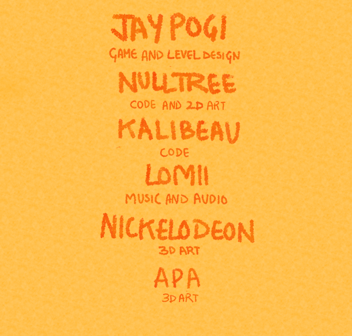

# What is this?

"A Growing Boy" was a game jam game made for the GWJ-#79 with the theme "Growing".

## How to play 

its available on itch.io check it out and tell us in the comments.
[https://clowntree.itch.io/a-growing-boy](https://clowntree.itch.io/a-growing-boy)

## TODO:
- [ ] audio not looping
- [ ] add 9 levels
- [ ] fix animations for walking
- [ ] fix animations for pushing
- [ ] lack of sfx
- [ ] needs post processing
- [ ] controls can be improved
- [ ] 2d art needs to be consistent
- [ ] maybe movement can be a bit faster
- [ ] better visual for dialog focus
- [ ] grammatic fixes for dialog

## Credits
